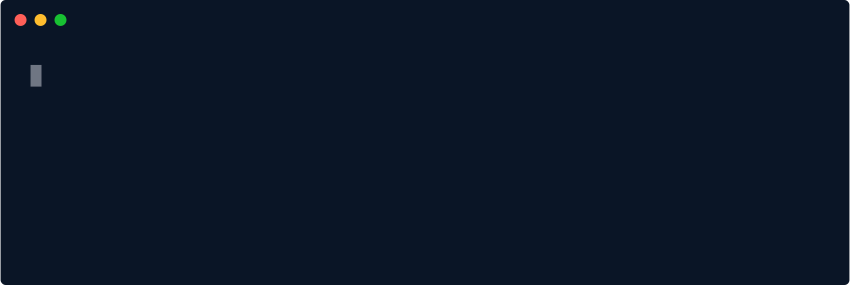
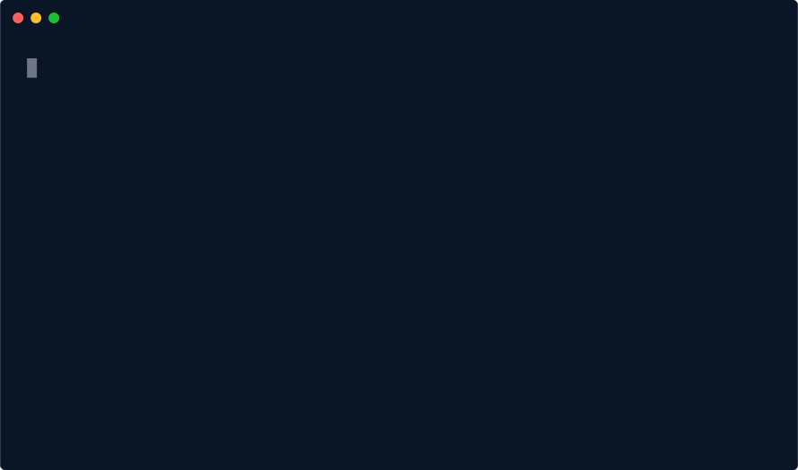

<picture>
  <source media="(prefers-color-scheme: dark)" srcset="dark.svg">
  <source media="(prefers-color-scheme: light)" srcset="light.svg">
  
</picture>

---

## 📜 À propos

Après plusieurs années dans le secteur **juridique**, j'ai opéré une reconversion vers la **cybersécurité**, avec un ancrage fort sur la **Gouvernance, le Risque et la Conformité (GRC)**. Cette trajectoire atypique me permet de lire un risque SI autant sous l'angle technique que réglementaire.

Ma formation **M1 Expert Réseaux, Infrastructures et Sécurité** (ORT Toulouse) m'a donné les bases infrastructure — Linux, réseaux, SIEM — pour dialoguer avec les équipes techniques, tout en maintenant l'orientation conformité : **RGPD · ISO 27001 · NIST CSF**.

- 🎓 Master Expert Réseaux, Infrastructures & Sécurité — **M1 obtenu (Mai 2026)** · **M2 à venir (2026–2027)**
- 🏛️ École : ORT Toulouse
- ⚖️ Socle juridique : Master en Droit Public — Université Aix-en-Provence
- 🌐 TOEIC 710 pts — Niveau B2
- 🔄 Recherche un **contrat de professionnalisation GRC**, rythme 3 semaines entreprise / 1 semaine école

---

## 🛠️ Stack Technique

**Sécurité & GRC**

**Systèmes & Infrastructure**

**Réseaux & ITSM**

**Cloud & DevOps**

---

## 🎯 Expertise GRC & Cybersécurité

| Domaine | Maîtrise | Détails |
|---|---|---|
| RGPD / Conformité | ██████████ 85% | Cartographie des traitements, obligations réglementaires, lecture juridique du risque SI |
| SIEM / EDR (Wazuh) | ████████░░ 82% | Centralisation de logs multi-sources, détection d'intrusions temps réel |
| GLPI (ITSM / ITAM) | ████████░░ 80% | Inventaire automatisé, workflows de tickets, gestion des actifs |
| SOAR (TheHive / Cortex / Shuffle) | ████████░░ 77% | Scénarios automatisés, enrichissement threat intel, MTTD 20s / MTTR < 1s |
| Analyse de risques SI | ████████░░ 78% | Identification, évaluation et priorisation des risques SI |
| NIST CSF | ███████░░░ 74% | Cadre de gouvernance et de gestion du risque cyber |
| Wireshark / VirusTotal | ███████░░░ 70% | Analyse de trafic réseau, investigation d'indicateurs de compromission |

---

## 🚀 Projets phares

<strong>🛡️ Wazuh SIEM / EDR sur Debian — Projet phare</strong>

 

Déploiement d'une plateforme Wazuh (SIEM/EDR) sur Debian : centralisation de logs multi-sources, règles de détection personnalisées, corrélation d'alertes et détection d'intrusions en temps réel.

| | |
|---|---|
| **Stack** | Wazuh, Debian |
| **Focus** | Centralisation de logs, détection d'intrusions temps réel |
| **Rapport** | [Voir le rapport](https://drive.google.com/file/d/1HPmBCzCME23pfI-i-Us2Gd8sgLCN9EAz/preview) |
| **Repository** | [Runbook Wazuh](https://github.com/AmelieGarnier/Wazuh-Suricata/blob/main/Runbooks/wazuh-runbook.md) |

<strong>🔍 Suricata IDS/IPS</strong>

 

Déploiement de Suricata en mode IDS/IPS : analyse de trafic réseau, écriture de règles de détection, inspection des alertes et corrélation avec les journaux système.

| | |
|---|---|
| **Stack** | Suricata, Debian |
| **Focus** | Règles de détection personnalisées |
| **Repository** | [Wazuh-Suricata](https://github.com/AmelieGarnier/Wazuh-Suricata/blob/main/Runbooks/suricata-runbook.md) |

<strong>⚡ SOAR — TheHive 4 · Cortex · Shuffle</strong>

 

Plateforme SOAR open source sur Docker, intégrée à Wazuh & Suricata : trois scénarios automatisés (brute force SSH, scan de ports, exfiltration DNS) avec enrichissement AbuseIPDB / VirusTotal, blocage Active Response conditionnel et notifications Discord.

| | |
|---|---|
| **Stack** | Docker, TheHive 4, Cortex, Shuffle |
| **Performance** | MTTD 20s · MTTR < 1s |
| **Sécurité** | Taux de blocage 100% · Alignement MITRE ATT&CK |
| **Impact** | Automatisation complète de 3 scénarios d'incident |
| **Repository** | [SOAR](https://github.com/AmelieGarnier/SOAR/blob/main/runbook-soar.md) |

<strong>🖥️ Active Directory — IAM & GPO</strong>

 

Mise en place d'un domaine Active Directory sur Windows Server : gestion utilisateurs, groupes, OU, déploiement de GPO et configuration des droits d'accès.

| | |
|---|---|
| **Stack** | Windows Server, Active Directory, GPO |
| **Focus** | IAM, gestion des droits d'accès |

<strong>📶 Zabbix 7.0 LTS — Supervision</strong>

 

Déploiement d'un serveur Zabbix 7.0 LTS sur VM Debian 13 dédiée. Supervision de 7 services critiques (Wazuh, SOAR, Active Directory) via agents et checks TCP, triggers multi-sévérités, alertes Discord en temps réel.

| | |
|---|---|
| **Stack** | Zabbix 7.0 LTS, Debian 13, MariaDB |
| **Performance** | Alertes en moins d'1 minute |
| **Repository** | [Zabbix](https://github.com/AmelieGarnier/Zabbix) |

<strong>🔄 Disaster Recovery — Kubernetes</strong>

 

Déploiement d'une architecture DR sur Kubernetes avec Rancher, RKE2, MinIO et Velero : sauvegardes programmées, simulation de sinistre et restauration complète d'un cluster en environnement virtualisé.

| | |
|---|---|
| **Stack** | Kubernetes, Rancher, RKE2, MinIO, Velero |
| **Focus** | Continuité d'activité / PRA |

<strong>☁️ Nextcloud — Cloud privé souverain</strong>

 

Cloud privé sur VM Debian 12 avec stack LAMP et MariaDB, axé sur la souveraineté des données, avec tests fonctionnels de partage et de synchronisation.

| | |
|---|---|
| **Stack** | LAMP, MariaDB, Debian 12 |
| **Focus** | Souveraineté des données |

<strong>🗂️ GLPI 10.0.17 — ITSM / ITAM</strong>

 

Installation et configuration de GLPI sur Debian 12, inventaire automatique Windows et Linux via FusionInventory, workflows de tickets et gestion des actifs.

| | |
|---|---|
| **Stack** | GLPI 10.0.17, Debian 12, FusionInventory |
| **Focus** | ITSM / ITAM |

---

## 📊 GitHub Analytics

---

## 🏅 GitHub Trophies

---

## 📈 Activité de contribution

---

## 🐍 Contribution Snake

---

## 🎯 Focus actuel

---

